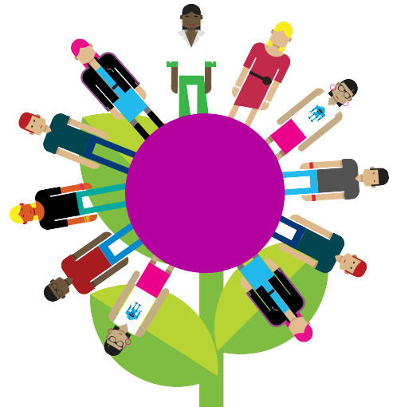

# User Journeys and User Stories

## What is the difference between a Journey and a Story?

## How might you make use of them in your projects?

- ...

## What is a user persona?

### Why do I need a user persona?

- we need help in making key design and functionality decisions during the UX process
- we need help when talking with our clients about what the user experience should be like
- we need help in creating realistic user journeys

### Who is the persona ?

- based on real users
- represents a particular audience segment
- based on various types of qualitative and quantitative research
- known motivations, frustrations (i.e. who they are)

### When to create a persona?

- create a persona during the initial discovery phase of your app.

### How do I create a persona?

- speak with your client – they will often have some information or insights about their audience in the form of marketing information, previous research and customer groups. However, **take this with a grain of salt as their perceptions of who their audience are may not always match the reality**.

- speaking with users – probably one of the most valuable ways of getting good qualitative data is to speak to the people who are likely to use it. This of course means you need a vague idea of the sorts of people you need to speak to.

- bespoke analytics - for example, social media interactions (a great way of seeing what type of people are interacting with similar brands). The more you can find out the richer and more valuable your personas will be.

### What info should be included in user persona?

- picture - try not to use stock photography as this - makes it hard to think about the persona as a real life person and can be difficult in - gaining credibility.
- demographic data such as age/location
- motivations
- goals
- pain points or frustrations
- a short bio about their background
- technical ability along with which devices they use and how often
- other brands or websites they may like
