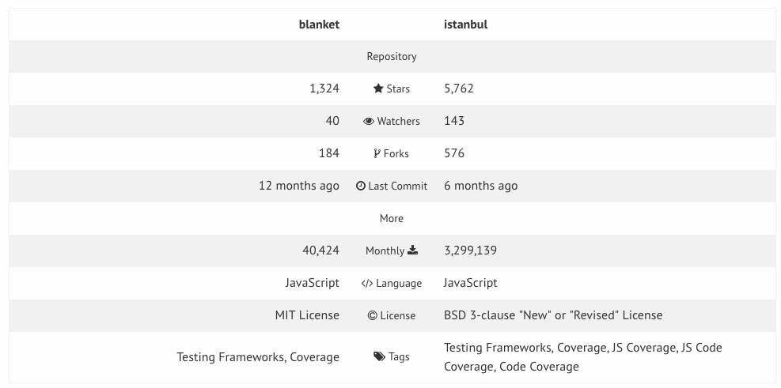

#BlanketJS

**What is code coverage?**

- Code coverage is a measurement of how many lines/blocks of your code are executed while the automated tests are running.

- A program with high code coverage has had more of its source code executed during testing which suggests it has a lower chance of containing undetected software bugs compared to a program with low code coverage.

- While it is a good metric of _how much_ testing you are doing, it does not necessarily test _how well_ you are testing your code.
- Keep in mind that there are things other than code coverage that you should use to test your code shouldn't obsess on 100% code coverage

**What is BlanketJS?**

A code coverage library/tool that gives you a statistic on what percentage of your code has been run through your tests.

**Why is BlanketJS Useful?**

1. BlanketJS compliments your JavaScript tests by adding code coverage statistics
2. BlanketJS works well with unit testing
3. Can run directly from the browser, and doesn't require Node

Weaknesses to Note:

1. Doesn't provide full coverage.
2. Have to use an old version of QUnit
3. Istanbul seems to be much more widely used/ more recently updated (see image below)

**Istanbul**

1. BlanketJS works well for unit tests, but with coverage for integration tests it is better to use Istanbul.
2. Istanbul does require Node.js
3. Istanbul is better at spotting untested code

**How to Use BlanketJS**

1. Add the BlanketJS library in the html file:

 ``

2. Install node modules and start the live server

`npm install live-server --save-dev && node_modules/.bin/live-server --port=8000`

3. Visit: http://localhost:8000/?coverage in your web browser
4. Check enable coverage

**Do it yourself!**

1. Open the files in blanketjs-example folder
2. Go to http://localhost:8000/?coverage to check your coverage
3. Try to write tests in test.js to get 100% coverage
4. Solutions are commented out below line 28 in test.js. Don't look until you've tried to solve it!

**Further resources:**

* [BlanketJS](http://blanketjs.org/)
* [BlanketJS GitHub](https://github.com/alex-seville/blanket)
* [Code Coverage](http://treyhunner.com/code-coverage-talk/#/)
* [Istanbul Github](https://github.com/gotwarlost/istanbul)
* [Dwyl Learn Istanbul](https://github.com/dwyl/learn-istanbul)
* [Integration test coverage with Istanbul](https://noamshemesh.wordpress.com/2014/07/05/integration-coverage-istanbul/)
