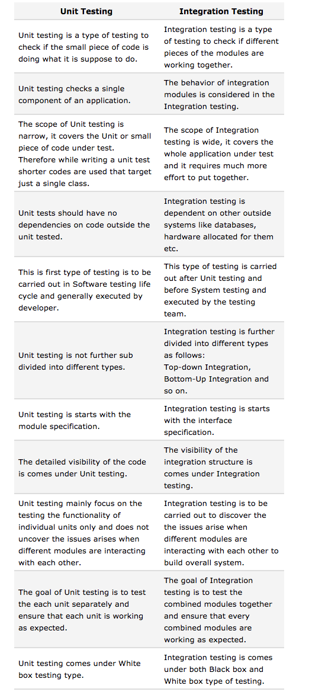

## Unit vs. Integration testing
:rage: :facepunch: :sparkles: :dizzy_face:

## First things first
It's not _really_ unit vs. integration. They are both part of complete and thorough testing flow.

Basics
---
## Unit testing ##
is a test written by the programmer to verify that a relatively small piece of code is doing what it is intended to do.

* They are narrow in scope.
* They are relatively easy to write as each test only tests one function or one conceptual unit.
* Their effectiveness depends on what the programmer considers to be useful.
* This tests each of them in isolation and does not test how they all work when combined.  

*This implies that everything outside the code being tested is simulated or ignored and that Unit tests shouldn't have dependencies*

## integration testing ##
The name integration testing refers to the integration of the components and is done to demonstrate that different pieces of the system work together. 
Integration testing identifies problems that occur when units are combined. 
Integration tests can cover whole applications, and can require much more effort to put together.

*This implies that dependencies and external resources (like database instances and hardware) are not simulated.*

There are currently 3 main approaches to integration testing:

1. **top-down approach** to integration testing requires the highest-level modules be test and integrated first.

2. **bottom-up approach** requires the lowest-level units be tested and integrated first. These units are frequently referred to as utility modules.

3. **Umbrella approach** requires testing along a given functionality elements. The primary advantage of this approach is that it provides completely tested functions early on in the release cycle.

### Handy comparison
[Stolen from here](http://www.softwaretestingclass.com/what-is-difference-between-unit-testing-and-integration-testing/)
    

