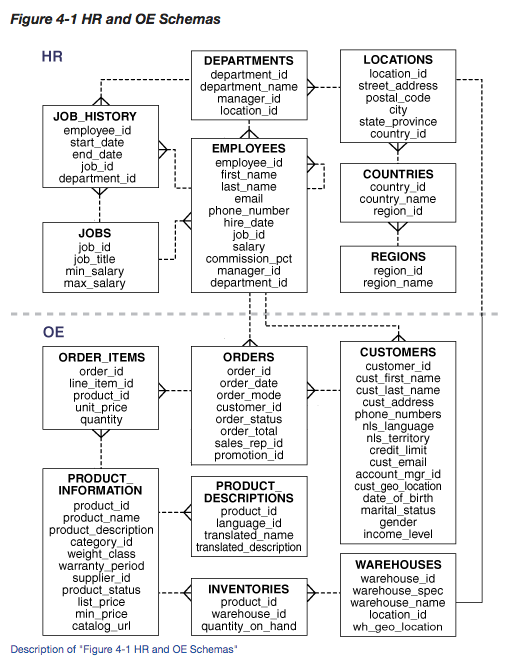

# Schemas and Relationships

* What is a schema and why/when would you need one?
* What are primary keys and why do we need them?
* Create a visual representation of a mock schema for a database about Founders & Coders, using as many different kinds of relationship as you can. Explain the logic behind it.


## What is a schema?
A database schema is the skeleton structure that represents the logical view of the entire database. It defines how the data is organized and how the relations among them are associated. It formulates all the constraints that are to be applied on the data.
A database schema defines its entities and the relationship among them. It contains a descriptive detail of the database, which can be depicted by means of schema diagrams. It’s the database designers who design the schema to help programmers understand the database and make it useful.

A database schema is a way to logically group objects such as tables, views, stored procedures etc. Think of a schema as a container of objects.
You can assign a user login permissions to a single schema so that the user can only access the objects they are authorized to access.
Schemas can be created and altered in a database, and users can be granted access to a schema. A schema can be owned by any user, and schema ownership is transferable.



The schema can also describe relationships between tables, like "the ids in column userid of table user_images should also be present in column userid of table users" (edited)
It's an inherent part of the database. You tell the database system the structure of your data via the schema so that it knows how to efficiently store and retrieve it
There are different approaches to persistent storage that operate differently, but the basic idea behind relational databases is that you pre-define logical table structures (the schema) and then execute queries to insert data into them and select data out of them
Knowing the schema before-hand allows the database to do a better job of optimizing than it would otherwise be able to if it had to figure out the structure of your data on the fly

## What is a primary key?
A primary key is a value in a table which must not be null, and must be unique for every row in the table. It is designed to be able to uniquely identify all table records.

### How do I make one?
In postgreSQL you can define a primary key by just writing PRIMARY KEY when creating the column of the table

so for example from today's workshop when creating the superheroes table:

```
CREATE TABLE superheroes (
  id SERIAL PRIMARY KEY NOT NULL,
  name VARCHAR(100) NOT NULL,
  superPower TEXT NOT NULL,
  weight INTEGER,
  canFly BOOLEAN NOT NULL DEFAULT FALSE
);
```

In the first line we define a column 'id', we tell SQL that it should be a SERIAL which is a self incrementing integer which will be unique for each row (pairs well with primary key because they are forced ot be unique), we write PRIMARY KEY to define this as the column which will be the primary key, and we define NOT NULL so that it cannot be null/falsy.

## Discover the structure of a PostgreSQL database?

For PostgreSQL:
` \d+ tablename ` will describe a particular table's schema, and `\dt` will list defined tables
